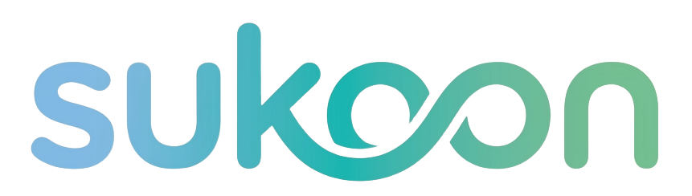

<div align="center">



### Mental Wellness Platform

*Find your peace, one therapy at a time*

[](https://nextjs.org/)
[](https://react.dev/)
[](https://www.typescriptlang.org/)
[](https://tailwindcss.com/)

[Live Demo](#) • [Documentation](#) • [Report Issue](#)

</div>

---

## 🌟 About Sukoon

**Sukoon** (meaning "peace" in Urdu/Hindi) is a comprehensive mental wellness platform designed to make mental health support accessible to everyone. We believe that mental wellness is a fundamental right, not a luxury.

Our platform offers a sanctuary where individuals can explore diverse, evidence-based therapy approaches tailored to their unique needs—completely free, available 24/7, and accessible from anywhere.

### Our Philosophy

- **Accessible**: No barriers, no appointments, no waiting lists
- **Diverse**: 9 unique therapy approaches for different needs
- **Personalized**: 6 mood-based themes to match your emotional state
- **Evidence-Based**: Every approach backed by research
- **Compassionate**: Designed with empathy and understanding

---

## 🎯 Therapies Offered

Sukoon provides **9 comprehensive therapy approaches**, each designed to address different aspects of mental wellness:

| Therapy | Description |
|---------|-------------|
| 🎧 **Audio Therapy** | Curated audiobooks and guided meditations for stress relief and personal development |
| 📚 **Reading Therapy** | Motivational quotes and book recommendations for mental wellness |
| 🧘 **Yoga Therapy** | Detailed asanas with visual guides for stress relief and flexibility |
| 👶 **Child Therapy** | Heartwarming content that triggers endorphins and reduces stress |
| ✨ **Spiritual Therapy** | Meditation practices and global wellness events |
| 💬 **Talking Therapy** | Educational content about depression, anxiety, and stress management |
| 😄 **Laughing Therapy** | Comedy videos for natural mood boost and endorphin release |
| 🎯 **Special Therapy** | Targeted wellness strategies for specific needs |
| 👨‍⚕️ **Doctor Consultation** | Direct integration with Practo for professional help |

---

## ✨ Key Features

### User Experience
- 🎨 **6 Mood-Based Themes** - Calm, Focus, Energize, Night, Serenity, Sunset
- 📱 **Fully Responsive** - Seamless experience across desktop, tablet, and mobile
- ♿ **Accessibility First** - WCAG compliant with keyboard navigation and screen reader support
- 🎭 **Smooth Animations** - Elegant transitions powered by Framer Motion
- 🧭 **Scroll-Based Navigation** - Intuitive browsing with active section highlighting

### Content & Resources
- 📖 **Curated Content** - Audiobooks, videos, articles, and quotes
- 🌍 **Global Events** - Upcoming wellness conferences and summits
- ❓ **Comprehensive FAQ** - Answers to common mental health questions
- 📧 **Contact Support** - Easy communication with our team

### Technical Excellence
- ⚡ **Optimized Performance** - Fast load times with lazy loading and code splitting
- 🔒 **Type-Safe** - 100% TypeScript for reliability
- 🎯 **SEO Optimized** - Server-side rendering for better discoverability
- 💾 **PWA Ready** - Install as an app with offline capabilities

---

## 🛠️ Tech Stack

<div align="center">

### Frontend Framework


### Styling & Animation


### Forms & Validation


### Development Tools


</div>

---

## 🎨 UI & UX Highlights

### Theme System
Sukoon features a unique **mood-based theme system** with 6 carefully crafted themes:

- 🌊 **Calm** - Soft blues and greens for tranquility
- 🔥 **Focus** - Warm oranges for concentration
- ⚡ **Energize** - Vibrant pinks for motivation
- 🌙 **Night** - Dark mode for evening relaxation
- ✨ **Serenity** - Soft teals for peace
- 🌅 **Sunset** - Warm reds for comfort

### Design Elements
- **Glass Morphism** - Modern, elegant UI effects
- **Gradient Backgrounds** - Beautiful color transitions
- **Smooth Scrolling** - Intuitive navigation experience
- **Micro-Interactions** - Delightful hover and click effects
- **Responsive Typography** - Optimized readability on all devices

### Accessibility
- Semantic HTML structure
- ARIA labels and roles
- Keyboard navigation support
- Sufficient color contrast ratios
- Screen reader compatibility

---

## 🚀 Getting Started

### Prerequisites

- **Node.js** 18.17.0 or higher
- **npm**, **yarn**, or **pnpm**

### Installation

```bash
# Clone the repository
git clone <repository-url>
cd sukoon

# Install dependencies
npm install

# Start development server
npm run dev
```

Visit [http://localhost:3000](http://localhost:3000) to see the application.

### Available Scripts

```bash
npm run dev          # Start development server
npm run build        # Create production build
npm start            # Start production server
npm test             # Run tests
npm run lint         # Check code quality
npm run format       # Format code with Prettier
npm run type-check   # Run TypeScript type checking
```

---

## 📁 Project Structure

```
sukoon/
├── src/
│   ├── app/                    # Next.js App Router pages
│   │   ├── page.tsx           # Home page
│   │   ├── therapies/         # Therapy pages
│   │   └── layout.tsx         # Root layout
│   ├── components/
│   │   ├── layout/            # Header, Footer, Navigation
│   │   ├── sections/          # Hero, About, Services, FAQ, Contact
│   │   ├── therapy/           # BookCard, YouTubeEmbed
│   │   └── ui/                # Reusable UI components
│   ├── context/               # Theme context
│   ├── data/                  # Static data (therapies, FAQs)
│   ├── hooks/                 # Custom React hooks
│   ├── lib/                   # Utility functions
│   ├── styles/                # Global styles
│   └── types/                 # TypeScript definitions
├── public/                    # Static assets
└── Configuration files
```

---

## 🌐 Deployment

### Vercel (Recommended)

[](https://vercel.com/new)

```bash
# Build for production
npm run build

# Start production server
npm start
```

### Environment Variables

Create a `.env.local` file:

```bash
NEXT_PUBLIC_APP_URL=https://yourdomain.com
```

---

## 🎯 Performance

Sukoon is built with performance in mind:

- ⚡ **Fast Load Times** - Optimized bundle sizes with code splitting
- 🖼️ **Image Optimization** - Automatic WebP conversion and lazy loading
- 📦 **Dynamic Imports** - Lazy loading for heavy components
- 🔄 **Caching Strategies** - Smart caching for faster subsequent loads
- 📊 **Lighthouse Score** - 90+ on all metrics

---

## ♿ Accessibility

Sukoon follows **WCAG 2.1 AA** guidelines:

- ✅ Semantic HTML structure
- ✅ ARIA labels and roles
- ✅ Keyboard navigation
- ✅ Screen reader support
- ✅ Sufficient color contrast
- ✅ Focus management
- ✅ Skip to content links

---

## 🧪 Testing

```bash
# Run all tests
npm test

# Run tests in watch mode
npm run test:watch

# Generate coverage report
npm run test:coverage
```

Testing includes:
- Unit tests for components
- Integration tests for pages
- Accessibility tests
- Property-based tests

---

## 📱 Progressive Web App (PWA)

Sukoon can be installed as a Progressive Web App:

- 📲 **Install on Device** - Add to home screen
- 🔌 **Offline Support** - Access content without internet
- 🔔 **Push Notifications** - Stay updated (coming soon)
- ⚡ **Fast Loading** - Cached resources for instant access

---

## 🤝 Contributing

We welcome contributions! Please follow these steps:

1. Fork the repository
2. Create a feature branch (`git checkout -b feature/amazing-feature`)
3. Commit your changes (`git commit -m 'Add amazing feature'`)
4. Push to the branch (`git push origin feature/amazing-feature`)
5. Open a Pull Request

### Code Standards

- Write TypeScript with proper types
- Follow existing code style
- Add tests for new features
- Ensure all tests pass
- Run linting and formatting

---

## 📄 License

This project is licensed under the [MIT License](LICENSE).

---

## 🙏 Acknowledgments

- **Next.js Team** - For the amazing framework
- **React Team** - For the powerful UI library
- **Tailwind CSS** - For the utility-first CSS framework
- **Framer Motion** - For smooth animations
- **Open Source Community** - For incredible tools and libraries

---

## 📞 Support

### Need Help?

- 📧 **Email**: contact@sukoon.com
- 💬 **Discussions**: [GitHub Discussions](#)
- 🐛 **Issues**: [Report a Bug](#)
- 📖 **Documentation**: [Read the Docs](#)

### Resources

- [Next.js Documentation](https://nextjs.org/docs)
- [React Documentation](https://react.dev)
- [Tailwind CSS Documentation](https://tailwindcss.com/docs)
- [TypeScript Documentation](https://www.typescriptlang.org/docs)

---

## ⚠️ Disclaimer

**Sukoon is a mental wellness support platform and is not a substitute for professional medical diagnosis, treatment, or therapy.** If you are experiencing a mental health crisis or emergency, please contact:

- **Emergency Services**: 911 (US) or your local emergency number
- **National Suicide Prevention Lifeline**: 988 (US)
- **Crisis Text Line**: Text HOME to 741741 (US)

Always consult with qualified healthcare professionals for medical advice and treatment.

---

<div align="center">

### 💙 Built with compassion for mental wellness

**Because everyone deserves Sukoon—everyone deserves peace.**

---

Made with ❤️ by the Sukoon Team

[Website](#)

</div>
